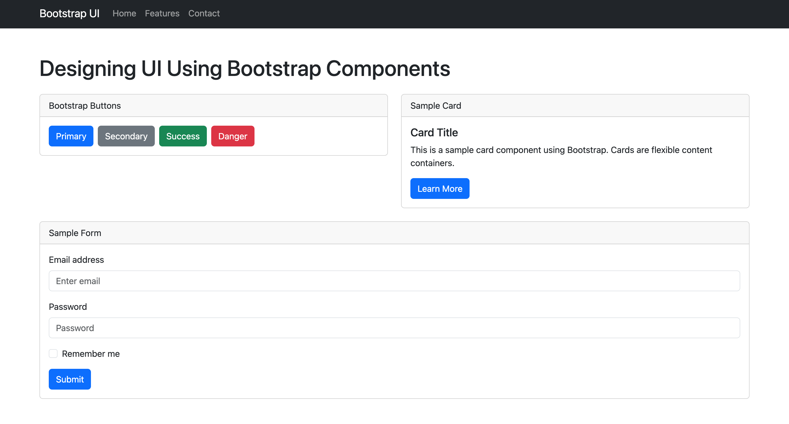
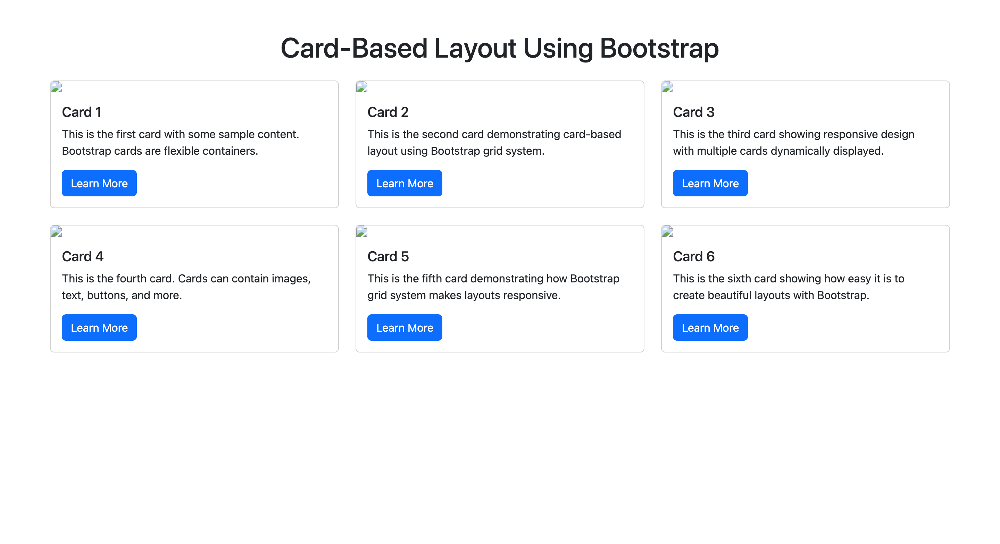
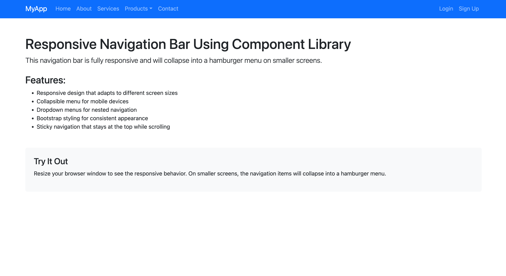

# Experiment 2: UI Design Using Component Libraries

## Overview

Unit-2 experiments demonstrating responsive UI design using Bootstrap components in React applications.

## Experiments

### 2.1 - Designing UI Using Bootstrap Components

Bootstrap buttons, cards, forms, and navigation bars



### 2.2 - Card-Based Layout Using Bootstrap

Dynamic card grid system with responsive design



### 2.4 - Responsive Navigation Bar Using Component Library

Collapsible navigation with dropdown menus



## Running an Experiment

```bash
cd 2.1  # or any experiment folder
npm install
npm run dev
```

## Tech Stack

- React 18
- Bootstrap 5.3
- react-bootstrap 2.9
- Vite
